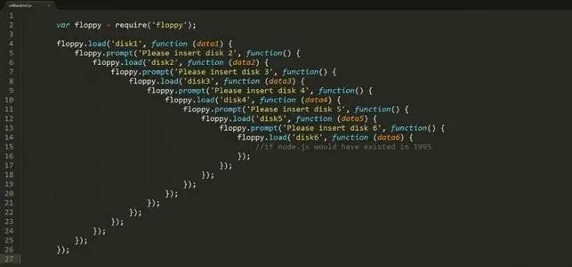

### 回调地域问题

传统的异步编程方式通过回调函数，处理异步任务到期的执行问题。而异步任务之间如果产生依赖关系，就会陷入“回调地域”问题。



### 状态
`Promise` 的状态`不可逆`  
有3个状态
- **Pending**
- **Resolved**
- **Rejected**

### 静态方法

- **Promise.resolve**
- **Promise.reject**

:::tip

只接收第一个参数

:::

<!--truncate-->

### 实例方法

#### .then

接收2个参数，`resolve` 方法和 `reject` 方法，形参为上一次状态的值。且这两个方法互斥，只能进入一个。  
返回一个新的 Promise 实例。

**传递给下一个 resolve 状态的方式：**
- return 一个值
- return Promise.resolve(值)
- 不写 return，默认返回 resolved ，传递的值为 `undefined`

**传递给下一个 rejected 状态的方式：**
- throw 抛出一个错误
- return Promise.reject(值)
- 错误代码

#### .catch
接收1个参数，`reject` 方法。形参为上一次 reject 状态的值
返回值同 `.then` ,都会返回一个`新的 Promise`

#### .finally
接收一个方法，没有任何状态值
返回值同 `.then` ,都会返回一个`新的 Promise`

返回待定 Promise ，只要 Promise 一解决，新 Promise 仍然会原样后传初始的 Promise

```javascript
let p1  = Promise.resolve(1);
let p2 = p1.finally(() => {
  return new Promise((resolve, reject)=>{
setTimeout(resolve,100,2)
  })
})


setTimeout(() => {
  setTimeout(console.log, 0, p2); // 1
},200)
```
### Thenable 接口对象

如果返回一个 实现了 `thenable` 的接口对象，则可以使用 Promise 上的 resolve 和 reject 方法。

```javascript
const p  = new Promise((resolve, reject) => {
  resolve(1)
}).then(() => {
  return {
    // 实现了 thenable 接口对象
    then: (resolve, reject) => {
      reject(2);
    }
  }
}).catch((error) => {
  return error
})

setTimeout(console.log,0,p)
```

### 幂等性(resolve)

给 Promise 传入 静态 Promise，类似于空包装  

```javascript
const p = Promise.resolve(1);  
console.log(p === Promise.resolve(p)); // true  
```

:::tip

`Promise.reject` 没有幂等性，给它传入一个 Promise对象，会变成拒绝的理由

:::

### 二元性

同步对象(在同步执行模式中使用)，但也是异步执行模式的媒介 。

```javascript
 try {
    Promise.reject(new Error("bar"));
  } catch (e) {
    // Promise.reject 不会进入
    console.log(e);
  }
```

### 值穿透

传给 `then()` 的任何`非函数类型的参数`都会被静默忽略

```javascript
let p1  = Promise.resolve(1);
let p2 = p1.then(2).then({}).then(undefined).then((res) => {
  console.log(res); // 1
})
```

### 状态穿透

并不是调用了 `resolve 方法`就一定会进入完成状态，如果传入的是一个 `promise 状态`，那么最终状态由该 promise 状态决定

### 事件循环机制

Promise 属于 `微任务`

### 批处理

可以给 Promise 添加多个任务，按添加的顺序依次执行

```javascript
let p1 = Promise.resolve();
p1.then(() => setTimeout(console.log, 0, 1));
p1.then(() => setTimeout(console.log, 0, 2));
// 1
// 2
```

### 中断 Promise 链

在链路中返回 `pending` 状态的 Promise ，即可中断后续链路。

```javascript
const p1 = new Promise((resolve, reject) => {
  resolve(1);
}).then((res) => {
  console.log(res);
  // 中断
  return new Promise(()=>{})
}).then((res) => {
  console.log(res)
})
```

### Promise 队列

**reduce 实现**

```javascript
const p1 = new Promise((resolve, reject) => {
  setTimeout(() => {
    resolve(1)
  },2000)
})

const p2 = new Promise((resolve) => {
  setTimeout(() => {
    resolve(2)
  },1000)
});

const p3 = new Promise((resolve) => {
  setTimeout(() => {
    resolve(3)
  },1000)
});

const promiseQueue = [p1,p2,p3];
promiseQueue.reduce((pre, cur) => {
  return pre.then(() =>{
    return cur.then((res) => {
      console.log(res)
    })
  })
},Promise.resolve())
```

**forEach 实现**

```javascript
const numbs = [1,2,3,4];

let promise = Promise.resolve();

numbs.forEach((v) => {
  promise = promise.then(() => {
    return new Promise((resolve)=>{
      setTimeout(() => {
        console.log(v);
        resolve();
      },1000)
    })
  })
})
```

### Promise.all

接收一个 Promise 实例数组  
数组内的全部 Promise 实例`全都变成了 resolve 状态`，就进入 resolved 状态。如果`有一个 rejected` 就进入 rejected 状态。  
如果进入 resolved 状态，返回的新 Promise 实例第一个方法参数会以数组的形式传入每项结果。  
如果进入 rejected 状态，返回的新 Promise 实例第二个方法参数会以单个值的形式传入拒绝的结果。  

```javascript
// resolved 状态
const p1 = Promise.resolve(1);
const p2 = Promise.resolve(2);

Promise.all([p1, p2]).then((res) => {
  console.log(res); // 打印 [1,2]
}, (res) => {
  console.log(res);
})

// rejected 状态
const p1 = Promise.resolve(1);
const p2 = Promise.reject(2);

Promise.all([p1, p2]).then((res) => {
  console.log(res);
}, (res) => {
  console.log(res); // 打印 2
})
```

### Promise.race

接收一个 Promise 实例数组  
只要 Promise 实例数组之中`有一个实例率先改变状态`，Promise.reace 的状态就`跟着改变`。那个率先改变的 Promise 实例的返回值，就传递给 Promise.reace 的回调函数。  
返回的新的 Promise 实例，会传入第一个改变的 Promise 结果。

```javascript
const p1 = Promise.resolve(1); // 率先改变
const p2 = Promise.reject(2);

Promise.race([p1, p2]).then((res) => {
  console.log(res); // 1
}, (res) => {
  console.log(res);
})
```

### Promise.allSettled

接收一个 Promise 实例数组  
只有等到参数数组的`所有 Promise 对象都发生状态变更（不管是 resolved 还是 rejected ）`，返回的 Promise 对象才会发生状态变更。  
返回的新的 Promise 实例，只接收第一个回调函数，且状态为 resolved,以数组的形式传入每项结果。数组由对象组成。对象中包含2个值——status（Promise状态） 和 value。

```javascript
const p1 = Promise.resolve(1);
const p2 = Promise.reject(2);

Promise.allSettled([p1, p2]).then((res) => {
  console.log(res); // [{ status: 'fulfilled', value: 1 },{ status: 'rejected', reason: 2 }]
})
```

### Promise.any(ES 2021 新特性)

接收一个 Promise 实例数组  
只要参数实例`有一个变成 fulfilled 状态，包装实例就会变成 fulfilled 状态`；如果所有参数实例都变成 rejected 状态，包装实例就会变成 rejected 状态。

### 封装一个简易定时器

```javascript
function timeout(delay = 1000) {
  return new Promise((resolve, reject) => {
    setTimeout(() => {
      resolve();
    }, delay)
  })
}
```

### 语法糖 async await

<comment/>
