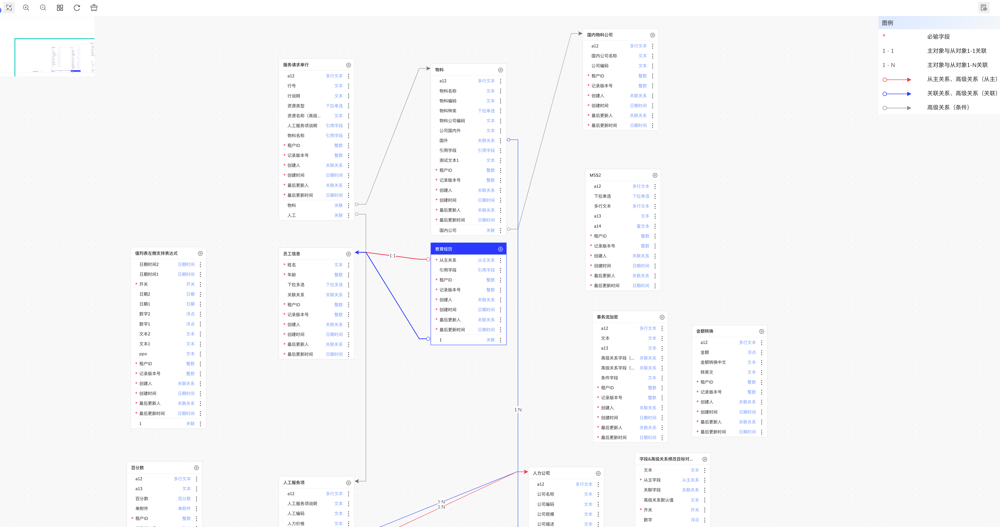

import Tabs from '@theme/Tabs';
import TabItem from '@theme/TabItem';

> X6 是 AntV 旗下的图编辑引擎，提供了一系列开箱即用的交互组件和简单易用的节点定制能力，方便我们快速搭建流程图、DAG 图、ER 图等图应用。

本文适用于有一定 [antv/x6](https://x6.antv.vision/zh) 使用基础的开发者。

## 实现效果

<p align="center">实现效果示意图</p>

业务对象 ER 图用来表示不同领域下不同业务对象之间的关系，如上图所示:  

- 一张卡片代表一个节点（业务对象），每个节点下有多个字段。
- 节点间关系，使用带有向箭头的边表示。不同关系会有不同的边颜色对应展示。
- 点击选中某个节点，与该节点所关联的边都会加粗高亮。
- 存在操作按钮，可动态切换每个节点内展示的关联/非关联字段。
- 可通过按钮操作业务对象的增删改查。
- 可拖拽节点，但是不能自建连线。
- 自动布局。

<!--truncate-->

## 技术栈
- react V16
- mobx V4
- @antv/x6 V1
- @antv/x6-react-shape v1

## 初始化 Graph

```ts
const graph = new Graph({
  container: document.getElementById(CONTAINER_ID)!,
  width: wrapperRef.current?.clientWidth || 0,
  height: wrapperRef.current?.clientHeight || 0,
  grid: {
    visible: true,
    size: 20,
    args: {
      color: '#f0f0f0',
      thickness: 3,
    },
  },
  background: { color: '#f8f8f8' },
  interacting: {
    nodeMovable: true, // 仅允许节点移动
  },
  scroller: {
    enabled: true,
    className: styles['graph-scroller'],
    pannable: {
      enabled: true,
      eventTypes: ['leftMouseDown'],
    },
    autoResize: true,
  },
  minimap: {
    enabled: true, // 开启缩略图
    container: document.getElementById(MINI_MAP_ID)!,
    width: 205,
    height: 128,
    padding: 0,
  },
  mousewheel: {
    enabled: true,
    modifiers: ['ctrl', 'meta'],
  }, // 允许鼠标滚轮缩放画布
  connecting: {
    router: {
      name: ER_ROUTER, // 基于 er 路由修改后的自定义路由
      args: {
        direction: 'H',
      },
    },
    // 屏蔽一些主动连线操作
    allowEdge: false,
    allowPort: false,
    allowBlank: false,
    allowLoop: false,
    allowMulti: false,
    allowNode: false,
  },
});
```

在以上的 ER 图的 Graph 配置仅供参考，可根据实际需要调整。全部的配置项可参考官网 [Graph](https://x6.antv.vision/zh/docs/api/graph/graph)。

## 注册节点
<div align="center">
    
</div>

由上图实现效果可以看出，每个节点有样式以及包含部分按钮交互效果，使用 x6 默认的描述 svg 标签的 markup、attrs 等参数实现较为复杂。因此我们采用[自定义 react 节点](https://x6.antv.vision/zh/docs/tutorial/advanced/react#%E6%B8%B2%E6%9F%93-react-%E8%8A%82%E7%82%B9)的形式，去创建节点。  
**注册 React 节点方式如下：**  
使用 `Graph.registerReactComponent(...)` 方法将 React 组件或返回 React 组件的函数注册到系统中。

```tsx
import React from 'react';
import { Graph } from '@antv/x6';

/**
 * 注册 ER 图节点
 */
export function registerReactERNode() {
  Graph.registerReactComponent(REACT_ER_NODE, <ERNode />);
  return () => Graph.unregisterReactComponent(REACT_ER_NODE);
}
```

`<ERNode />` 为 ER 图中每个节点的 react 组件。

**使用方式如下：**  

在初始化画布的 useEffect 中，在调用 `new Graph` 之前，调用 `registerReactERNode` 方法。`registerReactERNode` 会返回一个销毁的方法，在 useEffect 的 return 方法中调用。

```tsx
useEffect(() => {
  // 注册 react ER 图节点
  const erReactNodeDispose = registerReactERNode();
  // ......
  // 仅做初始化布局
  const graph = new Graph({......})

  return () => {
    graph.dispose();
    erReactNodeDispose();
    // ......
  };
}, []);
```

## 注册路由

因为 x6 自带的 [er 路由](https://x6.antv.vision/zh/docs/api/registry/router#er)没有完全满足场景，所以我们需要在官方提供的 er 路由上做一下参数的修改。
使用官方为注册自定义路由提供的 [registerRouter](https://x6.antv.vision/zh/docs/api/registry/router/#%E8%87%AA%E5%AE%9A%E4%B9%89%E8%B7%AF%E7%94%B1) 方法。标准的官方 er 路由实现需要从 x6 的 [github 源码](https://github.com/antvis/X6/blob/%40antv/x6%401.34.14/packages/x6/src/registry/router/er.ts)中复制出来。

<div align="center">
    
    
</div>
<p align="center">未优化前&nbsp;&nbsp;&nbsp;&nbsp;&nbsp;&nbsp;&nbsp;&nbsp;&nbsp;&nbsp;&nbsp;&nbsp;&nbsp;&nbsp;&nbsp;&nbsp;&nbsp;&nbsp;&nbsp;&nbsp;&nbsp;&nbsp;&nbsp;&nbsp;&nbsp;&nbsp;&nbsp;&nbsp;&nbsp;&nbsp;&nbsp;&nbsp;&nbsp;&nbsp;&nbsp;&nbsp;&nbsp;优化后</p>

如上图所示，针对节点自身的字段指向自己这种情况做优化。

```ts
/**
 * 注册 ER 路由
 */
export function registerERRouter() {
  Graph.registerRouter(ER_ROUTER, (vertices, options, edgeView) => {
    const offsetRaw = options.offset || 32;
    const min = options.min == null ? 16 : options.min;

    let offset = 0;
    let { direction } = options;

    const { sourceBBox, targetBBox } = edgeView;
    const sourcePoint = sourceBBox.getCenter();
    const targetPoint = targetBBox.getCenter();

    if (typeof offsetRaw === 'number') {
      offset = offsetRaw;
    }

    if (direction == null) {
      let dx = targetBBox.left - sourceBBox.right;
      let dy = targetBBox.top - sourceBBox.bottom;

      if (dx >= 0 && dy >= 0) {
        direction = dx >= dy ? 'L' : 'T';
      } else if (dx <= 0 && dy >= 0) {
        dx = sourceBBox.left - targetBBox.right;
        if (dx >= 0) {
          direction = dx >= dy ? 'R' : 'T';
        } else {
          direction = 'T';
        }
      } else if (dx >= 0 && dy <= 0) {
        dy = sourceBBox.top - targetBBox.bottom;
        if (dy >= 0) {
          direction = dx >= dy ? 'L' : 'B';
        } else {
          direction = 'L';
        }
      } else {
        dx = sourceBBox.left - targetBBox.right;
        dy = sourceBBox.top - targetBBox.bottom;
        if (dx >= 0 && dy >= 0) {
          direction = dx >= dy ? 'R' : 'B';
        } else if (dx <= 0 && dy >= 0) {
          direction = 'B';
        } else if (dx >= 0 && dy <= 0) {
          direction = 'R';
        } else {
          direction = Math.abs(dx) > Math.abs(dy) ? 'R' : 'B';
        }
      }
    }

    if (direction === 'H') {
      direction = targetPoint.x - sourcePoint.x >= 0 ? 'L' : 'R';
    } else if (direction === 'V') {
      direction = targetPoint.y - sourcePoint.y >= 0 ? 'T' : 'B';
    }

    if (offsetRaw === 'center') {
      if (direction === 'L') {
        offset = (targetBBox.left - sourceBBox.right) / 2;
      } else if (direction === 'R') {
        offset = (sourceBBox.left - targetBBox.right) / 2;
      } else if (direction === 'T') {
        offset = (targetBBox.top - sourceBBox.bottom) / 2;
      } else if (direction === 'B') {
        offset = (sourceBBox.top - targetBBox.bottom) / 2;
      }
    }

    let coord: 'x' | 'y';
    let dim: 'width' | 'height';
    let factor;
    const horizontal = direction === 'L' || direction === 'R';

    if (horizontal) {
      if (targetPoint.y === sourcePoint.y) {
        return [...vertices];
      }

      factor = direction === 'L' ? 1 : -1;
      coord = 'x';
      dim = 'width';
    } else {
      if (targetPoint.x === sourcePoint.x) {
        return [...vertices];
      }

      factor = direction === 'T' ? 1 : -1;
      coord = 'y';
      dim = 'height';
    }

    const source = sourcePoint.clone();
    const target = targetPoint.clone();

    source[coord] += factor * (sourceBBox[dim] / 2 + offset);
    target[coord] -= factor * (targetBBox[dim] / 2 + offset);

    if (horizontal) {
      const sourceX = source.x;
      const targetX = target.x;
      const sourceDelta = sourceBBox.width / 2 + min;
      const targetDelta = targetBBox.width / 2 + min;
      if (targetPoint.x > sourcePoint.x) {
        if (targetX <= sourceX) {
          source.x = Math.max(targetX, sourcePoint.x + sourceDelta);
          target.x = Math.min(sourceX, targetPoint.x - targetDelta);
        }
      } else if (targetX >= sourceX) {
        source.x = Math.min(targetX, sourcePoint.x - sourceDelta);
        target.x = Math.max(sourceX, targetPoint.x + targetDelta);
      }
    } else {
      const sourceY = source.y;
      const targetY = target.y;
      const sourceDelta = sourceBBox.height / 2 + min;
      const targetDelta = targetBBox.height / 2 + min;
      if (targetPoint.y > sourcePoint.y) {
        if (targetY <= sourceY) {
          source.y = Math.max(targetY, sourcePoint.y + sourceDelta);
          target.y = Math.min(sourceY, targetPoint.y - targetDelta);
        }
      } else if (targetY >= sourceY) {
        source.y = Math.min(targetY, sourcePoint.y - sourceDelta);
        target.y = Math.max(sourceY, targetPoint.y + targetDelta);
      }
    }

    // 如果是自己连自己
    if (sourcePoint.x === targetPoint.x) {
      target.x = source.x;
    }

    return [source.toJSON(), ...vertices, target.toJSON()];
  });

  return () => Graph.unregisterRouter(ER_ROUTER);
}
```
**注册路由方式如下：**
在初始化画布的 useEffect 中，在调用 `new Graph` 之前，调用 [registerERRouter](https://x6.antv.vision/zh/docs/api/registry/router/#%E8%87%AA%E5%AE%9A%E4%B9%89%E8%B7%AF%E7%94%B1) 方法。registerERRouter 会返回一个销毁的方法，在 useEffect 的 return 方法中调用。  
例：

```tsx
useEffect(() => {
  // 注册 ER 路由
  const erRouteDispose = registerERRouter();
  // ......
  // 仅做初始化布局
  const graph = new Graph({......})

  return () => {
    graph.dispose();
    erRouteDispose();
    // ......
  };
}, []);
```

## ERNode 组件实现
<div align="center">
    
    
</div>
这是我们要实现的一个 ER 节点的样式。在渲染写法上和普通 react 组件没什么区别，一个标题区域加一个列表区域，以及操作按钮触发菜单。区别在于如何触发数据状态更新。

`<ERNode/>`示例代码如下：

```tsx
import React, { memo } from "react";
import { ReactShape } from "@antv/x6-react-shape";
import { isEqual } from "lodash";

interface Props {
node?: ReactShape;
}

const ERNode: React.FC<Props> = ({ node }) => {
// 获取节点数据
const data = node?.getData() as BusinessObject & NodeExtraProps;
const {
selectedNodeId,
domainCode,
// ......
} = data;

// 更新节点方法示例
const handleShowNonRelationalFields = () => {
node?.setData({
...node?.getData(),
isShowNonRelationalFields: !isShowNonRelationalFields,
});
};

return // ......
};


export default memo(ERNode, (prev, next) => {
// 精确控制节点渲染
return !isEqual(prev.node?.getData(), next.node?.getData());
});
```

与普通的 React 组件更新方式不同，ERNode 组件接收一个 [node](https://x6.antv.vision/zh/docs/api/model/node) 属性，该属性为 x6 节点实例。node 节点下有个 [data](https://x6.antv.vision/zh/docs/tutorial/basic/cell#data) 属性。与节点/边关联的业务数据。例如，我们在实际使用时通常会将某些业务数据存在节点/边的 data 上。使用 `node.getData()` 方法可以获取到节点/边的 data。

为了精确控制 ERNode 组件渲染，避免节点过多时触发无效渲染影响组件性能，我们可以通过监听 node 上 data 的变化，来更新节点的渲染。

如果想要主动触发节点的更新，可以通过调用 `node.setData(...)` 方法来实现。


:::tip

如果想要在 ERNode 组件内获取外部 React Context（包括项目中常用的 mobx store） 的值，x6 文档中提供了 [Portal 机制](https://x6.antv.vision/zh/docs/tutorial/advanced/react#%E8%8E%B7%E5%8F%96%E7%BB%84%E4%BB%B6%E4%B8%8A%E4%B8%8B%E6%96%87)。但是使用了该方法获取外部上下文会导致小地图组件无法渲染。因此小地图和 X6ReactPortalProvider 只能二选一。

:::

值得注意的是，HTML/React/Vue 节点内容都是渲染在 SVG 的 [foreignObject](https://developer.mozilla.org/zh-CN/docs/Web/SVG/Element/foreignObject) 元素内部，因为浏览器的兼容性问题，经常会出现一些异常的渲染行为。主要表现形式为节点内容展示不全或者节点内容闪烁。可以通过以下方式来规避：
节点内部元素的 css 样式中不要使用 `position:absolute、position:relative、transform、opacity`。
在 Safari 浏览器上兼容性表现会更加差。**如果项目需要兼容 Safari 浏览器，建议不要在组件中使用 react 组件库（antd、c7n 等）的复杂组件。如果使用了，需要去 Safari 浏览器 验证一下是否兼容。**

## 连接桩的实现
<div align="center">
    
</div>

如上图所示，节点与节点间存在连线关系。根据 x6 对边连接位置的要求，我们需要在节点上定义连接桩。根据连接桩的位置，精准连线。  
因为连接桩的位置数据和字段类型数据有关联，所以**在生成初始化节点数据的时候注入连接桩数据**。每个连接桩的形状为字段行的形状，层级 `z-index` 设置为 -1，隐藏在节点层级之后。

<div align="center">
    
    
</div>

黑色区域即为生成的连接桩区域。连接桩生成的参数可参考如下代码：

```ts
const generatePorts = (id: string, attrs: Record<string, any>) => {
  return {
    id,
    markup: [
      {
        tagName: 'rect',
        selector: 'portBody',
      },
    ],
    args: {
      position: 'top',
    },
    attrs: {
      portBody: {
        width: ER_NODE_WIDTH,
        strokeWidth: 1,
        stroke: 'rgba(0,0,0,0)',
        fill: 'rgba(0,0,0,0)',
        magnet: true,
        transform: 'matrix(1,0,0,1,0,0)',
        ...attrs,
      },
    },
    zIndex: -1,
  };
};
```

`attrs` 为额外属性，在列表数据遍历时动态注入。

```ts
// 设置连接桩
const ports: any[] = [];
// 设置标题连接桩
ports.push(
  generatePorts(item.businessObjectId, {
    height: ER_LINE_HEIGHT,
  })
);
// 设置业务对象字段连接桩
item.businessObjectFields.forEach((field, index) => {
  // 如果是关联类型
  if (RELATION_TYPE.includes(field.componentType)) {
    ports.push(
      generatePorts(field.businessObjectFieldId, {
        height: ER_LINE_HEIGHT,
        refY: ER_TITLE_HEIGHT + ER_LINE_HEIGHT * index,
      })
    );
  }
});
```
根据不同的列表 y 轴位置结合索引生成 `refY` 参数，使得连接桩矩形在 y 轴产生偏移定义到所对应的关联字段区域。

ERNode 节点中有个`隐藏/显示非关系字段`的功能，该功能会影响到连接桩的生成。我们通过在 node 的 data 数据上绑定 `isShowNonRelationalFields` 属性来控制是否显示非关系字段。每当值切换时，连接桩位置也得重新计算。

## 节点和边数据的生成

在初始化节点的时候我们需要把后端传过来的数据格式化成 x6 节点需要的数据格式。

<Tabs>
  <TabItem value="1" label="后端的数据" default>

```ts
enum SourceType {
  PREDEFINE = 'PREDEFINE', // 系统预置
  PLATFORM = 'PLATFORM', // 平台自定义
  TENANT = 'TENANT', // 租户自定义
}

// 业务对象字段数据（包含关联）
interface BusinessObjectField {
  businessObjectFieldId: string;
  businessObjectId: string;
  businessObjectFieldCode: string;
  businessObjectFieldName: string;
  requiredFlag: boolean;
  componentType: FieldComponentType; // 业务对象组件类型
  inheritSourceType: string;
  requiredFlagValue: string;
  masterBusinessObjectId?: string; // 关联的业务对象id
  linkRelationType?: string; // 连接类型 ONE_TO_ONE ONE_TO_MANY
  relateType?: string; // 关系类型
}

// 业务对象高级关联数据
interface BusinessObjectAssociate {
  _token: string;
  businessObjectAssociateId: string;
  associateName: string;
  associateType: string;
  associateCode: string;
  linkRelationType: string;
  associateBusinessObjectId: string;
  preConditionFlag: boolean;
}

// 业务对象数据
interface BusinessObject {
  _token: string;
  businessObjectId: string;
  businessObjectCode: string;
  businessObjectName: string;
  domainId: string;
  domainCode: string;
  publishStatus: string;
  businessObjectFields: BusinessObjectField[];
  skipResetPhysicalSyncFlag: boolean;
  extendFieldCreatedFlag: boolean;
  updatePhysicalFlag: boolean;
  sourceType: SourceType;
  businessObjectCategory: string;
  flexFieldEnabledFlag: boolean;
  extendTableEnabledFlag: boolean;
  objectVersionNumber: number;
  businessObjectAssociateList?: BusinessObjectAssociate[];
  relationBusinessObjectIds?: string[]; // 与此对象关联的业务对象id
  extendFieldPrefixRule?: string;
  physicalModelType?: string;
}
```

  </TabItem>
  <TabItem value="2" label="格式化后的 x6 数据">

```ts
// 连接桩数据
interface Port {
  id: string;
  markup: any[];
  args: {
    position: string;
  };
  attrs: {
    portBody: {
      width: number;
      strokeWidth: number;
      stroke: string;
      fill: string;
      magnet: boolean;
      transform: string;
      height: number;
      refY?: number;
    };
  };
  zIndex: number;
}

// x6 节点数据
interface Node {
  id: string;
  component: string;
  data: object; // 渲染 ERNode 组件所需的数据
  height: number;
  width: number;
  shape: string; // 区分节点或边
  ports: Port[];
}

// x6 边数据
interface Edge {
  attrs: any[];
  labels: any[];
  shape: string;
  source: {
    cell: string;
    port: string;
  };
  target: {
    cell: string;
    port: string;
  };
}

type GraphData = Node[] | Edge[];

```

  </TabItem>
</Tabs>

通过 `formatBoDataToReactERGraph` 方法（见项目代码）去格式化后端数据，该方法会返回一个符合x6渲染数据类型的数组，数组中的每一项都是一个节点或边的数据。  

:::caution

后端返回的边数据包含全部与此节点有关联的数据。但是页面上展示的节点并不全是与此节点有关联的，所以我们在方法的最后一步需要对边数据进行过滤，**只保留与画布上节点有关联的数据**。如果添加的边数据的指向 id 的节点没有在画布中，则会报错。

:::

生成边的代码如下：

```ts
// 设置普通字段箭头
item.businessObjectFields.forEach((field) => {
  if (field.linkRelationType) {
    const edge: any = {
      shape: 'edge',
      source: {
        cell: item.businessObjectId,
        port: field.businessObjectFieldId,
      },
      target: {
        cell: field.masterBusinessObjectId,
        port: field.masterBusinessObjectId,
      },
      attrs: {
        line: getEdgeLine(field.componentType),
      },
      labels: getEdgeLabels(field.linkRelationType),
    };
    edgesData.push(edge);
  }
});
```

边的起终点数据都需要 `cell` 和 `port` 属性来决定边的坐标。
- `cell` 代表是目标节点，取自 `businessObjectFieldId`。
- `port` 代表是当前节点中的哪个连接桩，取自 `businessObjectId`。  

## 选中节点高亮周围边功能

<div align="center">
    
</div>

每个 ER 节点分为`选中`和`非选中`两种状态。当节点为选中状态时，会高亮节点和与节点相连的边。  
判断画布中哪个节点被选中的数据存在于节点的 `data` 数据中，通过 `selectedNodeId` 属性来控制。如果 `selectedNodeId` 和当前节点的 id 相等，则代表当前节点被选中。  
在外部数据管理中，`selectedNodeId` 存在于 Mobx Store 中统一管理，并且和 x6 画布中的节点数据进行绑定的。当更新 Mobx Store 的 `selectedNodeId` 的时候，会触发 x6 画布中节点的更新。  
我们可以通过 graph 提供的 `on 方法`，去监听节点点击事件。

```ts
function addNodeClickListener({ node }: NodeView.EventArgs['node:click']) {
  if (!graph) return;
  erStore.setState('selectedNodeId', node.getData()?.businessObjectId || '');
}

// 添加点击事件
graph?.on('node:click', addNodeClickListener);
```

```tsx
useEffect(() => {
  selectNode();
}, [erStore.getState('selectedNodeId')]);
```

这样使得副作用逻辑全部被提取到 `selectNode` 这一个方法中。

```tsx
export const NORMAL_SOURCE_EDGE_ATTR = {
  strokeWidth: 1,
  sourceMarker: {
    r: 4,
    cx: 4,
  },
};

export const SELECTED_SOURCE_EDGE_ATTR = {
  strokeWidth: 2,
  sourceMarker: {
    r: 5,
    cx: 5,
  },
};

const curNodeRef = useRef<Cell>(); // 当前选中的节点
const curEdgesRef = useRef<Edge[]>([]); // 当前选中的边

// 选中一个节点
function selectNode() {
  const selectedNode = graph?.getCellById(erStore.getState('selectedNodeId'));
  const selectedNodeId = selectedNode?.getData()?.businessObjectId || '';

  // 还原上一个选中节点颜色
  if (curNodeRef.current) {
    curNodeRef.current?.setData({
      ...curNodeRef.current.getData(),
      selectedNodeId,
    });
  }
  // 还原边
  if (isArray(curEdgesRef.current) && curEdgesRef.current.length > 0) {
    curEdgesRef.current?.forEach((edge) => {
      edge.attr('line/strokeWidth', NORMAL_SOURCE_EDGE_ATTR.strokeWidth);
      edge.attr('line/sourceMarker', {
        ...(edge.getAttrs().line.sourceMarker as any),
        ...NORMAL_SOURCE_EDGE_ATTR.sourceMarker,
      });
    });
  }

  if (selectedNode && graph) {
    // 设置选中状态
    selectedNode.toFront();
    selectedNode.setData({
      ...selectedNode.getData(),
      selectedNodeId,
    });

    // 设置边宽度
    const edges = graph.getConnectedEdges(selectedNode);
    edges.forEach((edge) => {
      edge.attr('line/strokeWidth', SELECTED_SOURCE_EDGE_ATTR.strokeWidth);
      edge.attr('line/sourceMarker', {
        ...(edge.getAttrs().line.sourceMarker as any),
        ...SELECTED_SOURCE_EDGE_ATTR.sourceMarker,
      });
    });

    curNodeRef.current = selectedNode;
    curEdgesRef.current = edges;
  } else {
    curNodeRef.current = undefined;
    curEdgesRef.current = [];
  }
}
```

在每次新选择一个节点时读取上一次存储的节点数据。如果有数据就还原，再设置当前选择节点的数据并备份到 `curNodeRef` 和 `curEdgesRef` 中。


## 自动布局
自动布局方法修改自 @antv/layout 中第三方开发者写的 [ErLayout](https://github.com/antvis/layout/blob/master/src/layout/er/index.ts)。主要修改了对数据格式的兼容和节点环绕的间距。


```ts
/**
 * 执行 ER 布局算法
 * @constructor
 */
export function executeERLayout(graph: Graph) {
  const nodes = graph.getNodes();
  const edges = graph.getEdges();
  const width = graph.container.clientWidth;
  const height = graph.container.clientHeight;
  // 加载 ER 图布局
  const ERLayoutInstance = new ERLayout({
    nodes,
    edges,
    nodeMinGap: 20,
    width,
    height,
  });

  return new Promise<void>((resolve) => {
    ERLayoutInstance.execute().then(({ nodes: newNodes = [] }) => {
      nodes.forEach((item) => {
        const node = newNodes.find((n) => n.id === item.id);
        if (node) {
          item.position(node.x || 0, node.y || 0);
        }
      });
      graph.zoomToFit({ padding: 10, maxScale: 1 });
      resolve();
    });
  });
}
```

## 参考资料

 - [antv/x6 官方文档(v1版本)](https://x6.antv.vision/zh/docs/tutorial/about)
 - [MDN SVG 相关文档](https://developer.mozilla.org/zh-CN/docs/Web/SVG)
