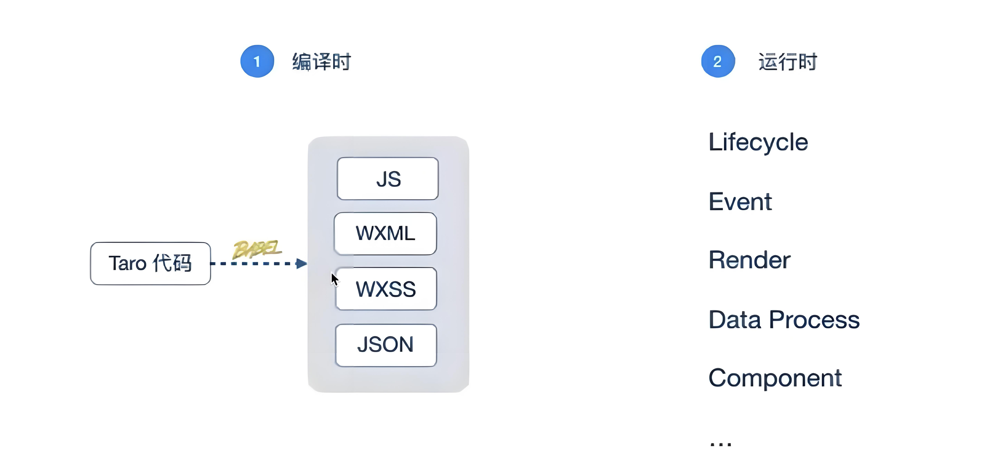
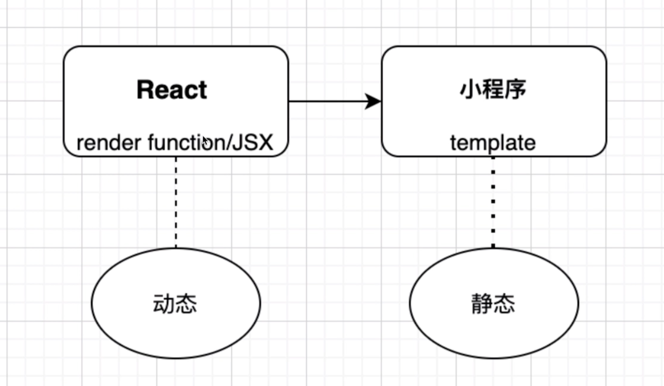
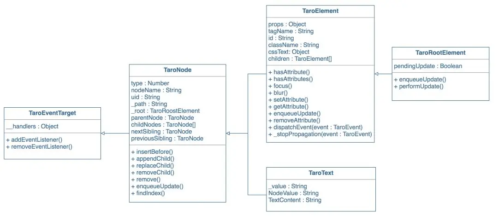
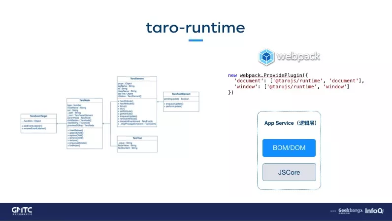
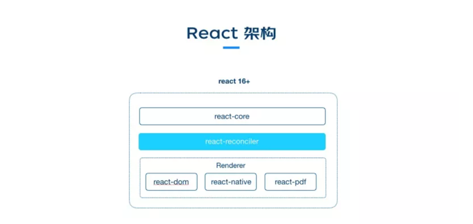
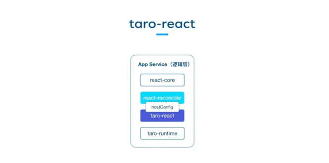
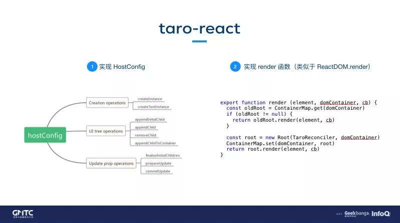
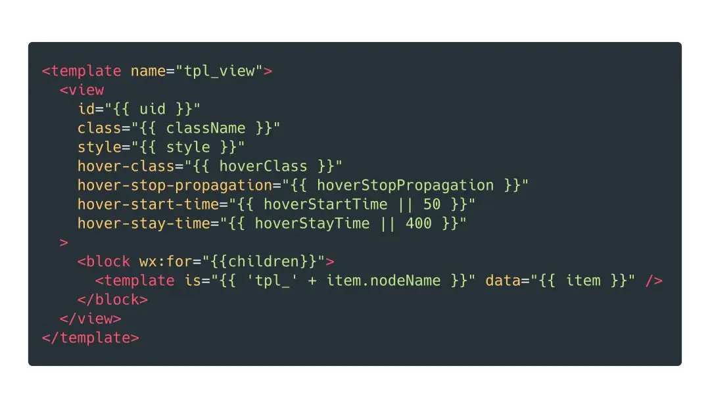
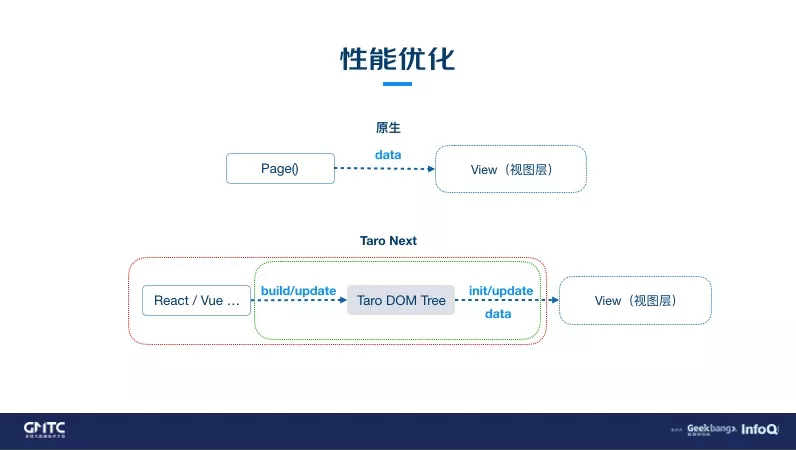

## Taro 2
> Taro 2 是一个重编译时轻运行时的框架，主要是通过编译时的转换来实现跨端能力。

它绑定了 React 的 DSL, 因此可以通过 React 语法来写小程序  
 - 编译时: 通过 babel 插件将 React 语法转换成小程序原生的语法
 - 运行时: 主要处理生命周期、事件、setData等, 运行时和 React 并没有关系

静态 template 转动态 JSX 相对简单, 但是反过来却十分困难。这是因为 JSX 过于灵活, Taro 2 采用穷举法来处理对 JSX 的适配, 工作量大。

    

## Taro 3
> Taro 3 是一个重运行时轻编译时的框架，主要是通过运行时的转换来实现跨端能力。

通过 Webpack 的 `ProvidePlugin` 插件，注入到小程序的逻辑层。

### Taro 3 的 React 适配

本质上是实现了一个 React 的自定义 Renderer, 通过 `taro-react` 包来连接 `react-reconciler` 和 `taro-runtime`。

具体实现过程分为以下两步:
1. 实现 `react-reconciler` 的 `hostConfig` 配置, 即在 `hostConfig` 的方法中调用对应的 Taro BOM/DOM 的 API
2. 实现 render 函数(类似于 `ReactDOM.render`)方法, 可以看成是创建 `Taro DOM Tree` 的容器

经过上面的步骤后, 在小程序的运行时就可以生成 `Taro DOM Tree`, 这个过程和 React 的渲染过程类似。

`Taro DOM Tree` 到小程序视图层的渲染过程分为以下步骤:
1. 将小程序所有的组件挨个进行模板化处理, 从而得到小程序组件对应的 template
2. 基于 template 将 `Taro DOM Tree` 进行递归渲染

### Taro 3 的 Vue 适配
React 和 Vue 在开发时区别那么大，其实在实现了 BOM/DOM API 之后，它们之间的区别就很小了。

Vue 和 React 最大的区别就在于运行时的 `CreateVuePage` 方法，这个方法里进行了一些运行时的处理，比如：生命周期的对齐。

    

### 优缺点

优点:  
  - **无 DSL 限制**: 能用 React/Vue 的语法来写小程序
  - **新特性无缝支持**: 由于 Taro3 的本质是将 React/Vue 的运行时注入到小程序中，因此可以直接使用 React/Vue 的新特性，比如 Hooks、Composition API 等。

缺点:
  - 和 Kbone/Remax 等运行时框架/库类似, 性能上肯定不及 Taro2/uni-app 的静态模板编译方案
  - 初始渲染需要使用 setData 传递全量的模板渲染描述数据,初始渲染性能较低
  - 视图更新时的性能完全取决于更新幅度

### 运行时优化
编译时所做的工作越多, 那运行时所做的工作就越少, 性能也会越好  

- Taro DOM Tree 的构建和更新
- setData 优化

#### 精简 DOM/BOM API
精简了 DOM/BOM API 的实现, 只保留了小程序所需的 API, 这样可以减少运行时的代码体积。

#### setData 优化
- 在数据更新阶段, Taro3 的更新时 DOM 级别的, 比 Data 级别的更新更高效。因为 Data 粒度的更新实际上是有冗余的, 并不是所有的 Data 改变都会引起 DOM 更新。
- 跟新的时候将 Taro DOM Tree 的 path 进行压缩, 这点多少能够提升点性能

    

#### 包 size
随着项目的增加，页面越来越多，原生的项目 WXML 体积会不断增加，而 Taro3 不会。也就是说，当页面的数量超过一个临界点时，Taro3 的包体积可能会更小。这是因为 Taro3 的组件 template 是固定的, 然后基于组件 template 去递归渲染。

    

<comment/>
